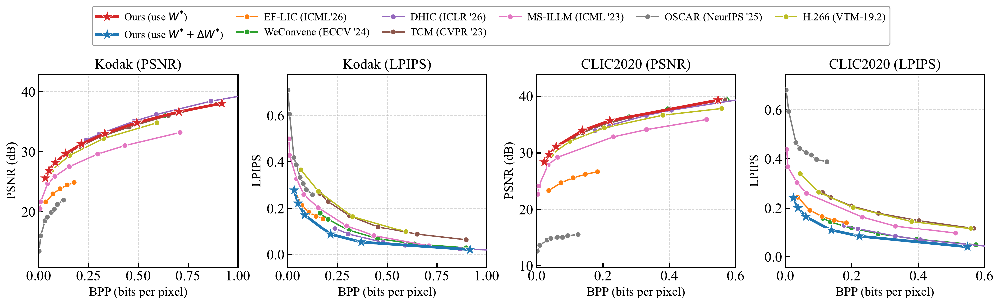
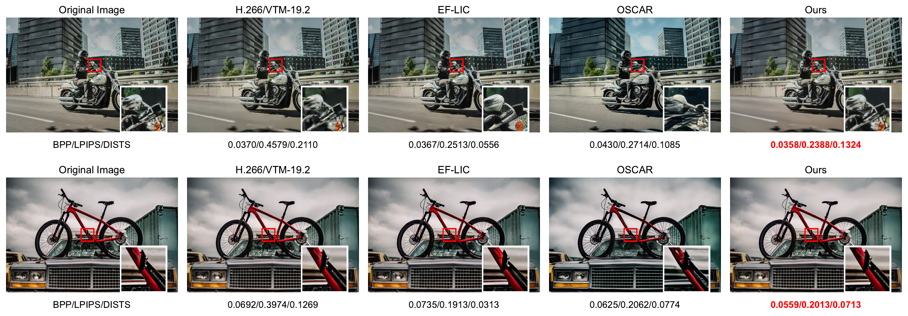
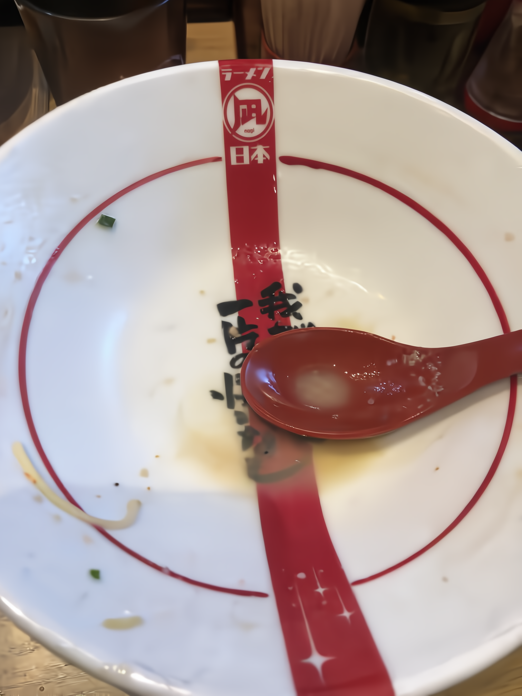
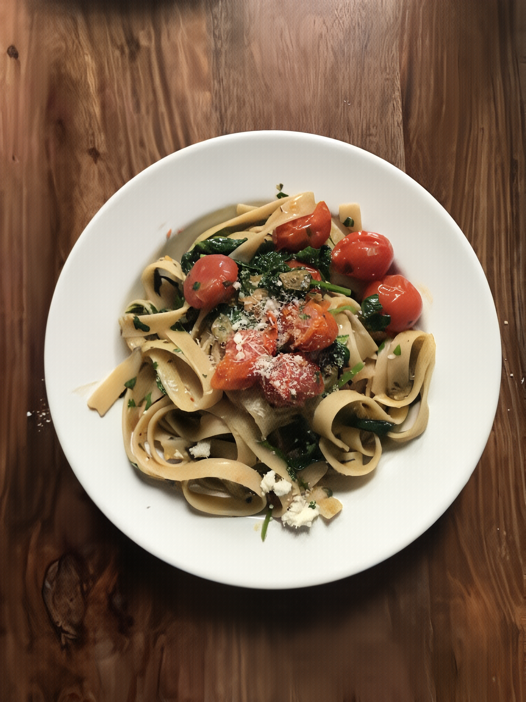

# Fidelity-Preserving Perceptual Image Compression via a Rate-Aware Mixture of LoRA Experts

This is the official implementation of paper --- "Fidelity-Preserving Perceptual Image Compression via a Rate-Aware Mixture of LoRA Experts".


## 📝 Abstract

Learned image compression (LIC) is typically optimized for rate–distortion performance, yet perceptual fine-tuning often shifts the codec away from its original fidelity-oriented operating point. To address this, we propose a parameter-efficient framework that decouples perceptual adaptation parameters from the fidelity-oriented parameters. Specifically, we insert low-rank adaptation (LoRA) modules into the synthesis transform and fine-tune them with perceptual objectives. By simply disabling these updates, the original decoder is recovered exactly, enabling reversible switching between fidelity and realism modes for the same bitstream. Furthermore, to address rate-dependent artifacts, we introduce a rate-aware mixture of LoRA experts, in which a soft router adaptively combines specialized low-rank updates conditioned on the quality level. Experiments show that the proposed method preserves the original rate–distortion performance while achieving superior perceptual quality compared to state-of-the-art approaches, with only a limited number of additional parameters.


## 🧩 Environment Requirements

```shell
torch>=2.0
pip install -r requirements.txt
```

Please build the `C++` code to support bitstream writing.

```shell

cd ./src/cpp
pip install .

```

## 📦 Checkpoint 

Put the inference checkpoint in the `ckpts` folder.

```txt
ckpts/*.pth.tar
```

You can download the pretrained checkpoint from [here](https://pan.quark.cn/s/a822592d2204)

## 🔄 Inference

```shell
bash test_moe_lora_image.sh
```

## 🧮 Evaluation 

Rate-Distortion & Rate-Perception Performance.

[](assets/evaluation.pdf)


## 🧰 Visual Comparison

[](assets/visual_comparison.pdf)


## 👀 More Visualization

Metrics below each reconstruction are **BPP / PSNR (dB) / LPIPS** (QP = 15).

| Original Image | Fidelity Mode | Perception Mode |
| :---: | :---: | :---: |
| <br>BPP/PSNR/LPIPS | <br>0.0197/33.95/0.31 | <br>0.0197/32.90/0.18|
| <br>BPP/PSNR/LPIPS | <br>0.1032/28.5/0.25 | <br>0.1032/27.7/0.11 |
| <br>BPP/PSNR/LPIPS | <br>0.0365/30.98/0.39 | <br>0.0365/29.84/0.19 |

## ⏳ Citation

```
TBD.
```


# 🤝 Acknowledgment

This work is built on [DCVC-RT](https://github.com/microsoft/DCVC) and [LoRA](https://github.com/microsoft/LoRA). Thanks for their awesome work!
